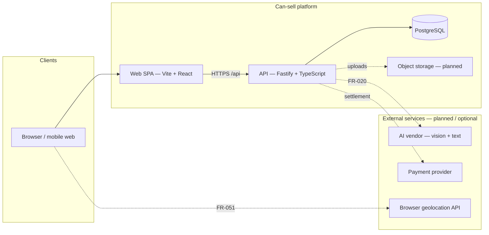
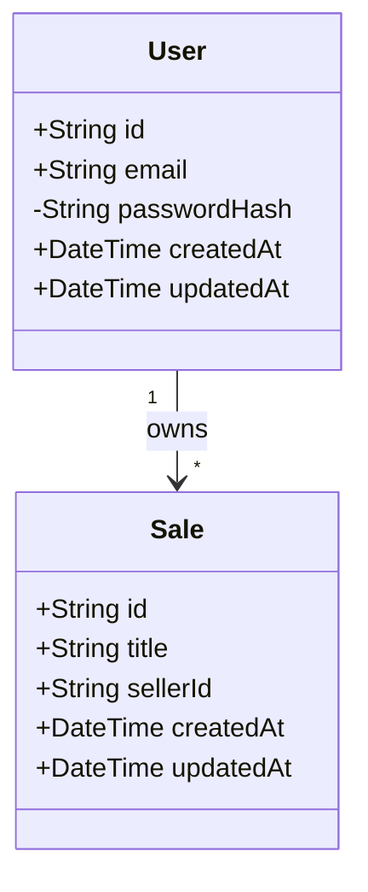
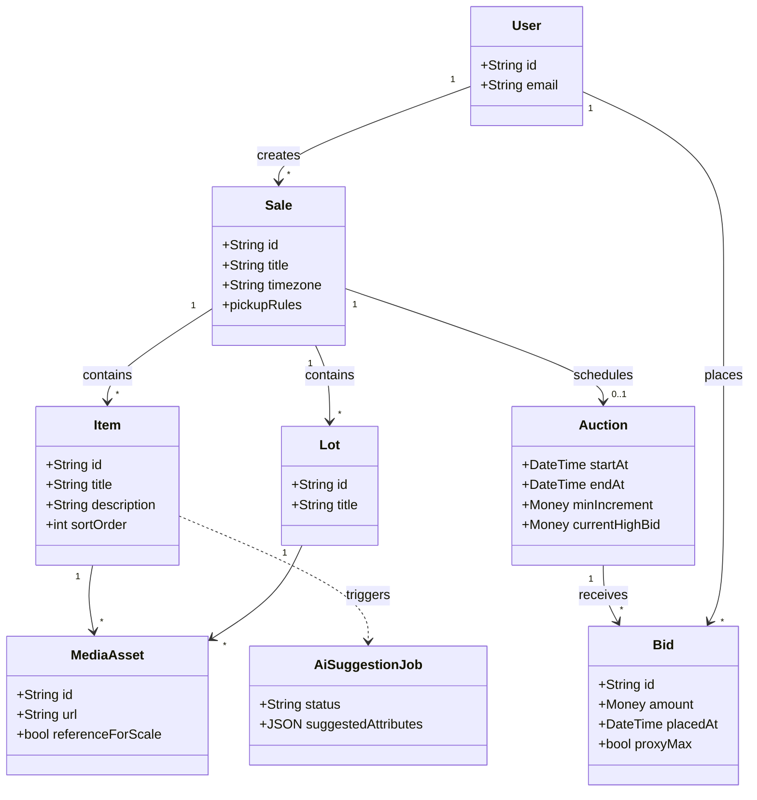
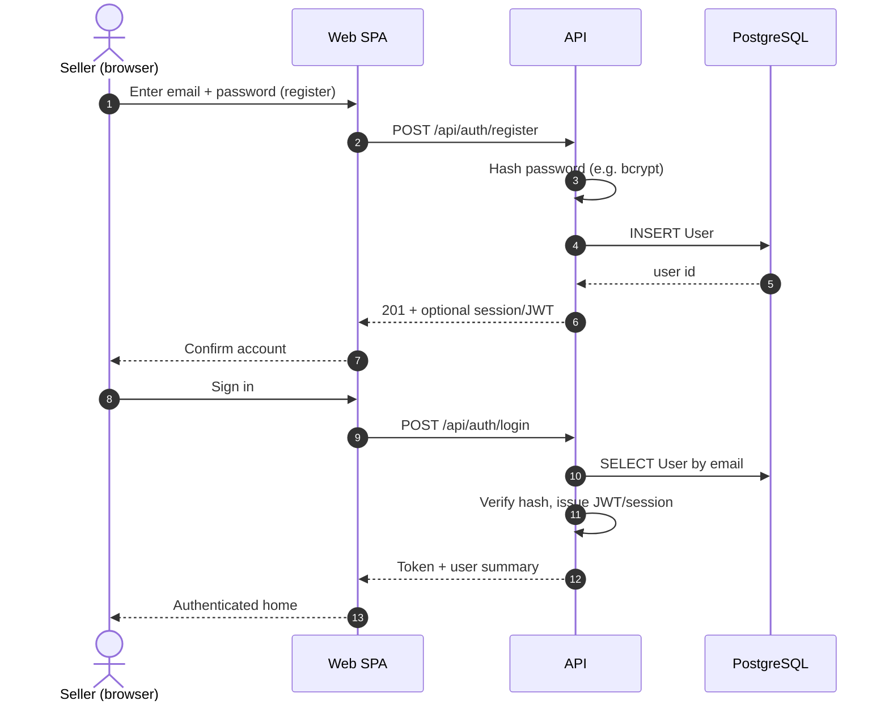
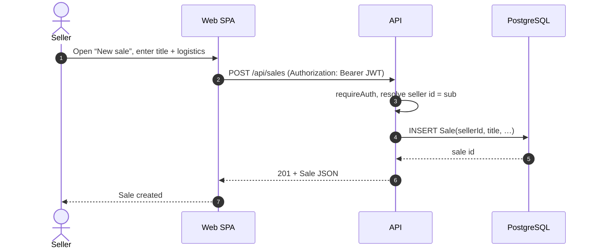
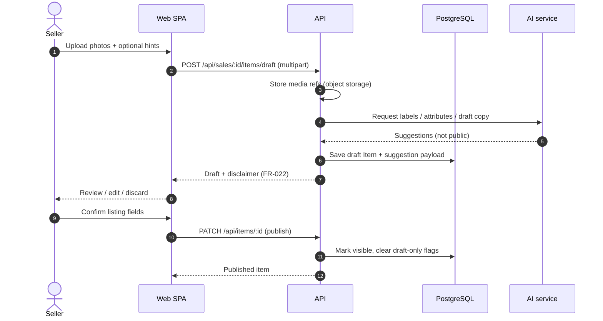
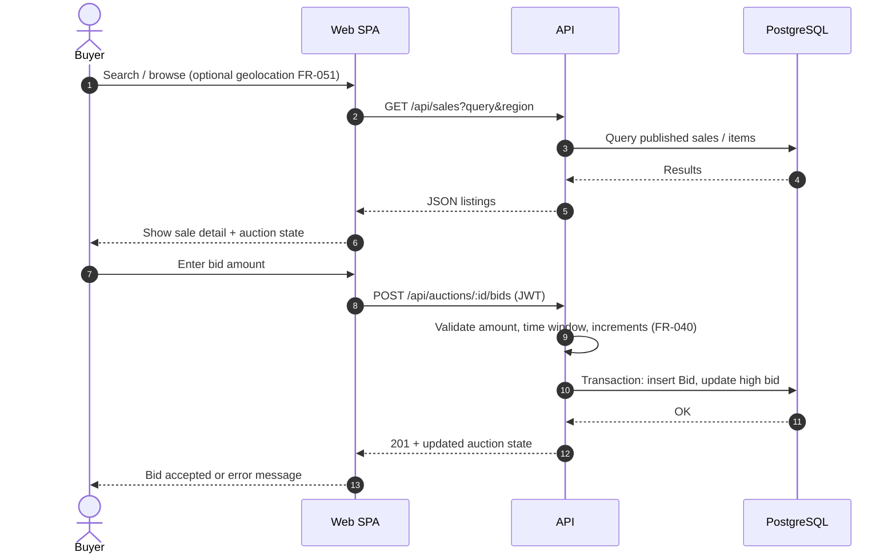
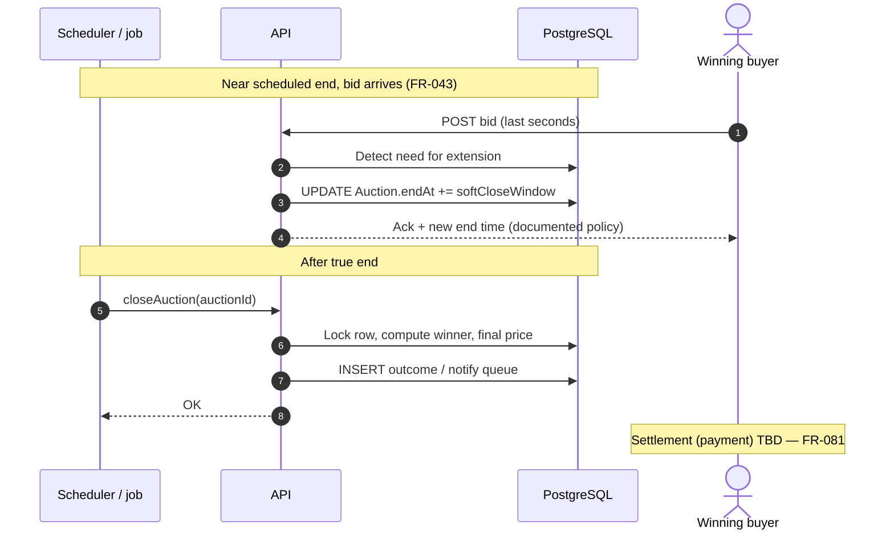
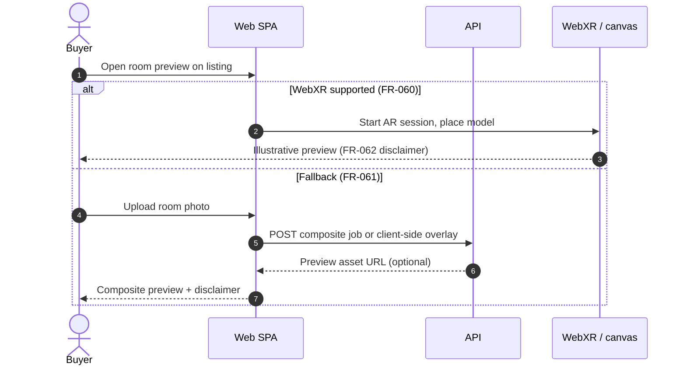
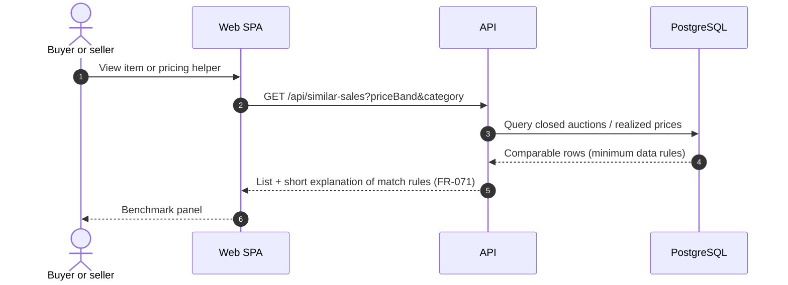

# Can-sell — High Level Design (HLD)

**Copyright (C) 2026 Brighter Sight Inc.** Licensed under GPL-3.0-or-later.

This document summarizes **architecture**, a **logical data model** (as implemented and as planned), and **typical interaction flows**. It complements [Vision.md](./Vision.md), [requirements.md](./requirements.md), and [design-decisions.md](./design-decisions.md).

**Status:** Living document. The codebase today implements **User** / **Sale** in the database and **health/version** routes on the API; diagrams labeled *planned* describe the target product.

---

## 1. System context

---

## 2. Component view (logical)

| Component | Responsibility |
|-----------|----------------|
| **Web SPA** | Responsive UI: seller listing wizard, buyer browse/bid, progressive use of camera, geolocation, WebXR where available ([Vision.md](./Vision.md)). |
| **API** | Auth, sales/catalog, auctions/bids, AI orchestration, media URLs, business rules (e.g. **≤255** items per sale — FR-011). |
| **PostgreSQL** | System of record via Prisma ([schema](./apps/api/prisma/schema.prisma)). |
| **Object storage** *(planned)* | Listing images, room-preview assets. |
| **AI vendor** *(planned)* | Suggest category, attributes, copy from images (FR-020–022). |

Deployment is **web-only** for v1 (no native store apps). Dev ports follow **ADR-004** (`26` + DD + slot).

---

## 3. Data model — class diagrams

### 3.1 Implemented persistence (Prisma)

Reflects the current [schema.prisma](./apps/api/prisma/schema.prisma).

### 3.2 Target domain (conceptual — planned entities)

Extends the model toward [requirements.md](./requirements.md) (items, auctions, bids, media, AI jobs). **Not all tables exist yet**; names are indicative.

**Notes**

- **FR-011:** enforce **≤255** `Item`/`Lot` rows (or equivalent) per `Sale` in the API.
- **Single-item vs grouped lot (FR-013):** may be modeled as `Item` vs `Lot` or a discriminated type; diagram shows both for clarity.

---

## 4. Sequence diagrams — typical use cases

### 4.1 Seller registration and sign-in (FR-001, FR-002)

*Planned flow once auth routes are implemented.*

### 4.2 Create a sale (FR-010, FR-003)

### 4.3 Add catalog item with AI assist (FR-020–022)

*Human-in-the-loop: nothing published until seller confirms.*

### 4.4 Buyer discovers sale and places a bid (FR-050, FR-041, FR-040)

### 4.5 Auction soft-close and winner (FR-043, FR-044)

### 4.6 “How will this look in my room” (FR-060, FR-061)

### 4.7 Similar sales at a price (FR-070, FR-071)

---

## 5. Security and trust (summary)

| Topic | Design intent |
|--------|----------------|
| **Auth** | JWT or session for FR-002; HTTPS in production. |
| **Authorization** | Seller scoped to own `Sale` / items (FR-003); bid rules prevent tampering with others’ bids. |
| **AI** | Suggestions never auto-published (FR-021); seller attestation where required. |
| **Privacy** | Geolocation only with consent (FR-004 / FR-051). |

---

## 6. Related artifacts

| Artifact | Role |
|----------|------|
| [implementation-plan.md](./implementation-plan.md) | Phased delivery |
| [test-plan.md](./test-plan.md) | Verification by FR/NFR |
| [traceability.md](./traceability.md) | Requirement ↔ test ↔ code |
| [apps/api/README.md](./apps/api/README.md) | Current API surface |

---

## Document history

| Date | Change |
|------|--------|
| 2026-03-29 | Initial HLD with Mermaid class + sequence diagrams |
